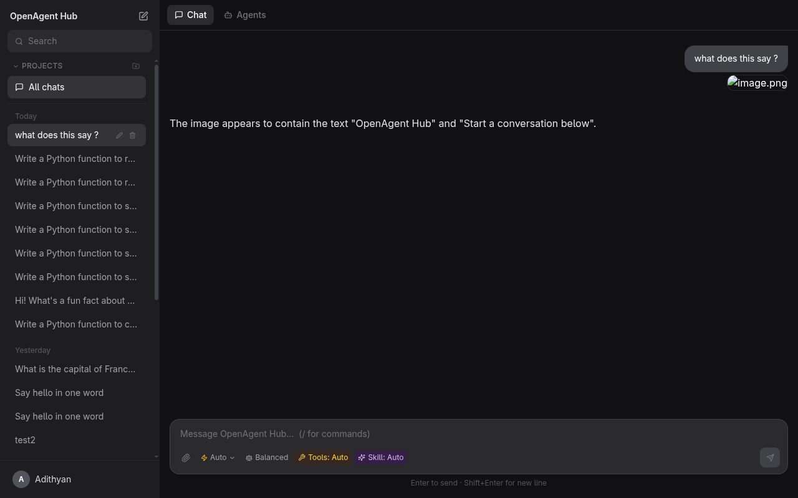
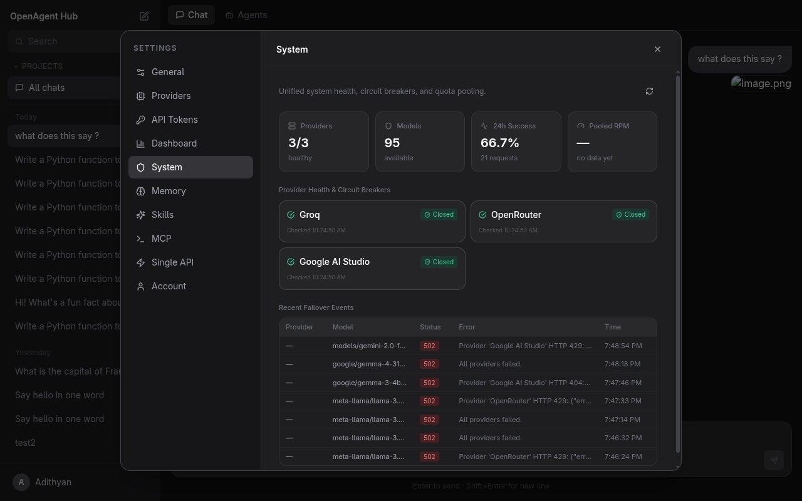
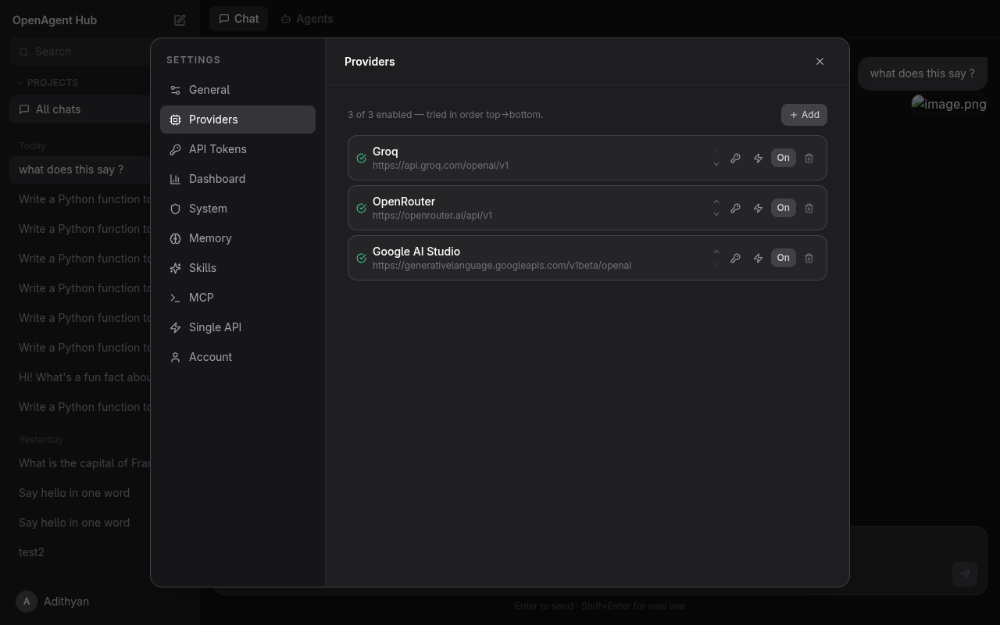
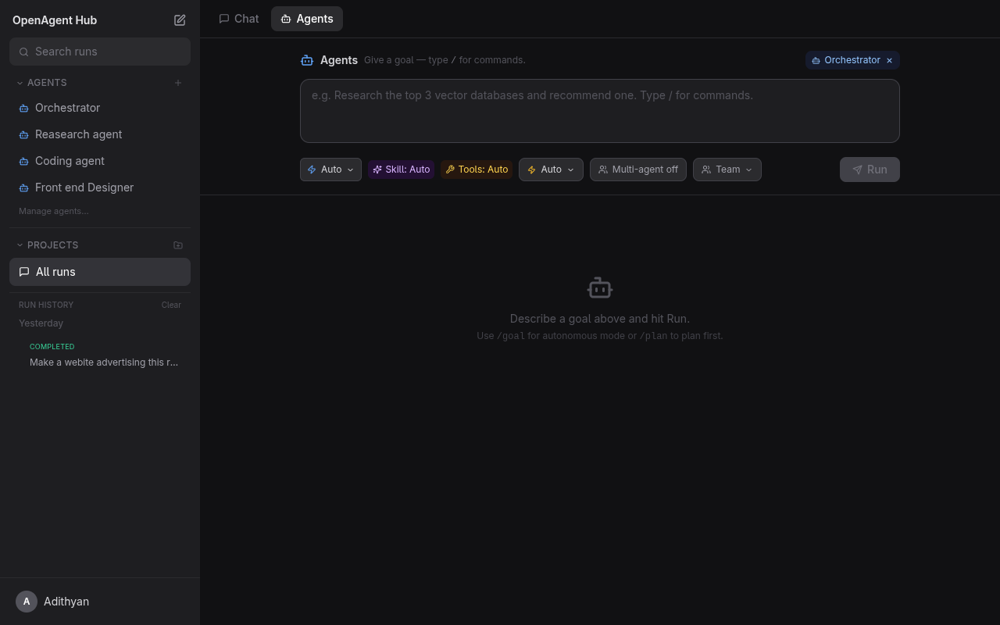

<p align="center">
  
</p>

<h1 align="center">OpenAgent Hub</h1>

<p align="center">
  <strong>A self-hosted AI operating system that unifies LLM providers, models, agents, tools, and memory into one platform.</strong>
</p>

<p align="center">
  Connect Groq, OpenRouter, Google AI Studio, Mistral, NVIDIA NIM, and 15+ more providers.<br/>
  Route to the best free model for each task. Failover automatically. Zero cost.
</p>

<p align="center">
  
  
  
  
  
</p>

---

## Screenshots

| Chat | System Health |
|:---:|:---:|
|  |  |

| Providers | Agents |
|:---:|:---:|
|  |  |

---

## Quick Start

**Prerequisites:** Docker and Docker Compose.

```bash
git clone https://github.com/AdithyanandanArun/openagent-hub.git
cd openagent-hub
docker compose up -d --build
```

Open [http://localhost:3000](http://localhost:3000), register an account, and add your first provider.

> Frontend runs on port **3000**, backend API on port **8000**.

---

## Features

### Chat & Workspace

- ChatGPT-style conversations with streaming, markdown, code highlighting (Prism), and KaTeX math
- Projects to organize conversations
- Message editing and regeneration
- File and image attachments with clipboard paste support
- Image vision — pasted/attached images are sent to vision-capable models via base64 encoding

### Multi-Provider Engine

- **20 provider presets** — one-click setup for Groq, OpenRouter, Google AI Studio, Mistral, NVIDIA NIM, Cohere, Cerebras, GitHub Models, HuggingFace, Cloudflare Workers AI, SambaNova, OVHcloud, DeepInfra, and more
- **Any OpenAI-compatible endpoint** works as a custom provider
- **Free-only model catalog** — paid models are automatically filtered out using provider-specific rules
- **170+ model families** classified with speed, coding, knowledge, vision, and reasoning scores
- **Grouped model picker** with capability badges (vision, reasoning, fast, context window)

### Intelligent Routing

- **Auto mode** — analyzes your message to detect coding, reasoning, vision, or long-context needs, then picks the best free model
- **4 routing modes:**
  - **Balanced** — smart task-aware routing (default)
  - **Speed** — fastest response time, picks flash/mini models
  - **Quality** — best knowledge and reasoning, picks pro/large models
  - **Reliability** — proven uptime from your actual request history
- **Reliability tracking** — aggregates success rates, latency, and error rates per model

### Circuit Breaker Failover

- **DB-persisted circuit breakers** with three states: closed, open, half-open
- **Exponential backoff** — 60s → 120s → 240s → 480s → 600s max cooldown
- **Error classification** — retryable (429, 500, 502, 503, 504) vs non-retryable (400, 401, 403, 404)
- **Automatic recovery** — health probes reset circuit breakers when providers come back online
- **Quota pooling** — tracks upstream `x-ratelimit-*` headers for RPM/TPM awareness

### Intelligence Layer

- **Memory** — persistent user, project, and conversation memory injected into chats and agent runs
- **Agent framework** — give a goal; the agent plans, calls tools in a ReAct loop, and streams a live timeline
- **Multi-agent** — coordinator agents spawn sub-agents that run in parallel and share memory
- **Tools** — built-in (calculate, memory, time) plus any tool from connected MCP servers
- **MCP integration** — register stdio MCP servers for dynamic tool discovery
- **Skills** — reusable instruction sets (Code Review, Research, Documentation, Refactoring, Testing, + custom)

### System Dashboard

- Unified health overview: providers, models, 24h success rate, pooled RPM
- Per-provider circuit breaker state, failure counts, cooldown timers
- RPM/TPM quota gauges with color-coded bars
- Failover event log with status codes and error details

### Platform

- JWT authentication with API token management
- Request logging and analytics with latency tracking
- OpenAI-compatible `/v1/chat/completions` API for external tool integration
- Light and dark theme
- Fully self-hosted with Docker Compose

---

## Supported Free Providers

| Provider | Free Tier | Notes |
|----------|-----------|-------|
| **Groq** | All models free | Per-model rate limits, no card required |
| **Google AI Studio** | All models free | Gemini 2.5/3.x, per-project limits |
| **OpenRouter** | `:free` suffix models | ~20 RPM / 200 RPD |
| **Mistral** | All models free | Experiment plan, phone-verified |
| **NVIDIA NIM** | Dev credits + free models | Key starts with `nvapi-` |
| **Cohere** | 1000 calls/mo trial | Non-commercial, all models |
| **Cerebras** | ~1M tokens/day | No card, 8K context cap |
| **GitHub Models** | All models free | PAT with `models:read` scope |
| **Cloudflare Workers AI** | 10K Neurons/day | Requires Account ID |
| **SambaNova** | 200K TPD | No card, fast inference |
| **OVHcloud** | 2 RPM/model | Anonymous, EU-hosted |
| **DeepInfra** | Free serverless tier | Selected open-weight models |

---

## Adding Providers

1. Click your username → **Settings** → **Providers**
2. Click **Add** (or use a quick-add preset)
3. Enter a name, base URL, and API key
4. Click **Test** to verify — only free models are synced
5. Models from all enabled providers appear in the model picker

---

## Using Agents

1. Switch to the **Agents** tab
2. Type a goal, optionally pick a **Skill** and toggle **Multi-agent**, then **Run**
3. Watch the live timeline: thoughts, tool calls, tool results, and the final answer
4. Past runs are saved in the **Run history** panel

### Memory, Skills & MCP

- **Memory** (Settings → Memory) — facts injected into every chat and agent run
- **Skills** (Settings → Skills) — five built-in + custom instruction sets
- **MCP** (Settings → MCP) — register stdio MCP servers for additional agent tools

---

## Tech Stack

| Layer | Technology |
|-------|------------|
| **Backend** | FastAPI, SQLAlchemy 2.0, Alembic, PostgreSQL |
| **Frontend** | React 18, TypeScript, Vite, Tailwind CSS |
| **Rendering** | react-markdown, remark-gfm, KaTeX, Prism |
| **Auth** | JWT (python-jose), bcrypt |
| **Serving** | nginx (frontend), uvicorn (backend) |
| **Runtime** | Docker Compose |

---

## Project Structure

```
openagent-hub/
├── backend/
│   ├── app/
│   │   ├── api/            # FastAPI route handlers
│   │   ├── models/         # SQLAlchemy ORM models
│   │   ├── schemas/        # Pydantic request/response schemas
│   │   ├── services/       # Business logic (routing, failover, taxonomy)
│   │   └── main.py
│   ├── migrations/         # Alembic migrations (001–013)
│   └── requirements.txt
├── frontend/
│   ├── src/
│   │   ├── components/     # React components
│   │   ├── hooks/          # Custom React hooks
│   │   ├── pages/          # Page components
│   │   └── services/       # API client functions
│   └── package.json
├── docker-compose.yml
└── README.md
```

---

## Architecture

All 12 phases of the system are complete:

| Phase | Description |
|:-----:|-------------|
| **1** | Foundation — auth, conversations, streaming chat, markdown rendering |
| **2** | Production UX — attachments, message editing, projects, themes |
| **3** | Multi-Provider — provider registry, dynamic models, routing, failover |
| **4** | Unified Model Layer — model catalog with capability metadata |
| **5** | Memory System — user, project, and conversation memory |
| **6** | Agent Framework — autonomous execution, task planning, tool calls |
| **7** | MCP Integration — stdio MCP servers, dynamic tool discovery |
| **8** | Multi-Agent — sub-agents, parallel execution, shared memory |
| **9** | Skills System — reusable composable agent capabilities |
| **10** | Intelligent Routing — model taxonomy, 4 routing modes, free-only catalog |
| **11** | Automatic Failover — circuit breakers, exponential backoff, error classification |
| **12** | AI Operating System — unified system dashboard, quota pooling, health monitoring |

---

## Development

Run with live reload (backend mounts `./backend` as a volume):

```bash
docker compose up
```

Backend API: `http://localhost:8000` — Interactive docs: `http://localhost:8000/docs`

Rebuild frontend only:

```bash
docker compose up -d --build frontend
```

### Public deployment prerequisites

Production starts fail closed. Supply these values from a secret manager rather
than committing them to Git: a 32+ character `SECRET_KEY`, a base64-encoded
32-byte `ENCRYPTION_KEY`, a TLS PostgreSQL `DATABASE_URL`, explicit HTTPS
`ALLOWED_ORIGINS`, and `PUBLIC_APP_URL`.

For the browser-only public beta, set:

```bash
ENVIRONMENT=production
ENABLE_OPENAI_COMPAT_API=false
ENABLE_CUSTOM_MCP_SERVERS=false
ENABLE_WORKSPACE_OPEN=false
EMAIL_DELIVERY_MODE=resend
RESEND_API_KEY=...
EMAIL_FROM=OpenAgent Hub <accounts@example.com>
RUN_MIGRATIONS=false
STORAGE_BACKEND=gcs
GCS_BUCKET=openagent-hub-production-attachments
GOOGLE_CLOUD_PROJECT=your-gcp-project
REDIS_URL=redis://your-managed-redis:6379/0
ENABLE_HEALTH_PROBES=false
```

Run Alembic separately as a one-shot deployment job. New accounts must verify
their email before they can sign in; existing installations are marked verified
by migration `014` to avoid locking out current users.

Attachments use local storage in development and private Google Cloud Storage in
production. The application authorizes every download; do not make the bucket
or its objects public.

Public API replicas use Redis for authentication throttling, per-user chat
limits, daily quotas, and concurrent streaming limits. Provider health checks
must run once through `python -m app.health_probe_runner`, not in every replica.

## Public deployment (GKE)

Phase 3 adds a production deployment path for a browser-only public beta. It
uses a regional private-node GKE Autopilot cluster, Cloud NAT, a private GCS
bucket for attachments, Standard HA Memorystore Redis, Artifact Registry,
Secret Manager, a GKE managed TLS certificate, and GitHub Actions workload
identity federation. Supabase remains the managed PostgreSQL provider; no
Supabase credentials are stored in this repository.

The supplied Terraform intentionally creates secret *containers*, not secret
versions. This prevents Terraform state, Helm values, GitHub Actions logs, and
Git from ever receiving the database URL, encryption material, or Resend key.

### 1. Provision cloud resources

Authenticate with an administrator account, copy the example variables, and
apply Terraform. Configure a versioned remote GCS backend in
[`infrastructure/terraform/versions.tf`](infrastructure/terraform/versions.tf)
before sharing the state with a team.

```bash
cd infrastructure/terraform
cp terraform.tfvars.example terraform.tfvars
# Edit only project/resource identifiers; do not add secret values.
terraform init
terraform apply
```

Record these outputs: `cluster_name`, `attachments_bucket`,
`ingress_static_ip_name`, `ingress_ip_address`, `application_service_account`,
`github_actions_service_account`, `github_workload_identity_provider`, and
`secret_resource_names`.

### 2. Add runtime secret versions

Create the values interactively (or from a trusted secret-management workflow),
never in a shell history, `.tfvars`, Helm values file, or GitHub variable. The
database URL must be the Supabase PostgreSQL URL with TLS required; use the
pooled connection endpoint where appropriate for the selected Supabase plan.

```bash
gcloud secrets versions add openagent-production-database-url --data-file=-
gcloud secrets versions add openagent-production-secret-key --data-file=-
gcloud secrets versions add openagent-production-encryption-key --data-file=-
gcloud secrets versions add openagent-production-resend-api-key --data-file=-
```

The encryption key is a base64-encoded 32-byte value. For example, generate it
locally with `openssl rand -base64 32`; retain the prior key only in your
external recovery process until all data encrypted with it has been rotated.

### 3. Configure DNS and GitHub deployment variables

Create an `A` record for the intended public hostname (for example,
`app.example.com`) pointing to Terraform's `ingress_ip_address`. Set these
repository or `production` environment variables in GitHub:

| Variable | Source |
|---|---|
| `GCP_PROJECT_ID`, `GCP_REGION`, `GKE_CLUSTER`, `ARTIFACT_REPOSITORY` | Terraform inputs/outputs |
| `GCP_WORKLOAD_IDENTITY_PROVIDER`, `GCP_DEPLOYER_SERVICE_ACCOUNT` | Terraform outputs |
| `GCP_APP_SERVICE_ACCOUNT`, `GCS_BUCKET`, `INGRESS_STATIC_IP_NAME` | Terraform outputs |
| `REDIS_INSTANCE` | `openagent-production-redis`, unless renamed |
| `PUBLIC_HOST`, `EMAIL_FROM` | Your verified domain and Resend sender |
| `DATABASE_URL_SECRET`, `SECRET_KEY_SECRET`, `ENCRYPTION_KEY_SECRET`, `RESEND_API_KEY_SECRET` | The four Terraform-created Secret Manager secret IDs |

The GitHub OIDC provider is restricted by Terraform to the
`github_repository` value, so set it to the exact `owner/repository` that will
run deployments. The deployer has Artifact Registry write and GKE admin access;
keep the GitHub `production` environment protected with required reviewers.

### 4. Deploy and verify

Push a signed/reviewed tag beginning with `v`, or run the **Deploy production**
workflow manually. It builds immutable images, pushes them to Artifact Registry,
runs the Helm pre-upgrade migration job, and waits for the deployment.

```bash
git tag v0.1.0
git push origin v0.1.0

kubectl -n openagent get pods,ingress,managedcertificate
kubectl -n openagent get cronjob
```

Wait until the `ManagedCertificate` is `Active`, then open
`https://<PUBLIC_HOST>`. GKE's Secret Manager CSI add-on mounts and syncs the
runtime secrets only inside workload pods; the GCS bucket stays private and all
attachment downloads continue through application authorization.

The chart lives in [`helm/openagent`](helm/openagent) and requires values for
the image references, public hostname, GCP service account, Redis URL, and
Secret Manager resource names. The CI workflow renders it with representative
non-secret values on every pull request.

## Low-cost beta deployment (Cloud Run)

For a small, invite-only beta, use the separate Cloud Run profile in
[`deployment/cloud-run-beta`](deployment/cloud-run-beta) rather than the GKE
platform above. It keeps the same FastAPI application, Supabase PostgreSQL,
private GCS attachments, Secret Manager, email verification, and encrypted
provider keys, but replaces GKE and Memorystore with a scale-to-zero Cloud Run
service and Upstash Redis. The production GKE platform remains available for a
later scale-up without a database or attachment migration.

1. Provision only the beta resources:

   ```bash
   cd infrastructure/cloud-run-beta
   cp terraform.tfvars.example terraform.tfvars
   # Set your GCP project, GitHub owner/repository, and a unique bucket name.
   terraform init
   terraform apply
   ```

2. Add versions to the four Secret Manager secret IDs from
   `terraform output secret_ids`: `DATABASE_URL` (Supabase with
   `sslmode=require`), `SECRET_KEY`, base64 32-byte `ENCRYPTION_KEY`,
   and `REDIS_URL`. For Redis, create an Upstash Free database and store its
   TLS connection URL (`rediss://...`) as the entire `REDIS_URL` secret. The
   beta uses open registration and does not require the Resend email
   verification path or an invited-user list. Do not put any of these values in
   Terraform, GitHub variables, or this repository.

3. Create a `beta` GitHub Environment and add these variables from Terraform:
   `BETA_GCP_PROJECT_ID`, `BETA_GCP_REGION`, `BETA_ARTIFACT_REPOSITORY`,
   `BETA_RUNTIME_SERVICE_ACCOUNT`, `BETA_GCS_BUCKET`,
   `BETA_WORKLOAD_IDENTITY_PROVIDER`, and `BETA_DEPLOYER_SERVICE_ACCOUNT`.
   Also add `BETA_PUBLIC_APP_URL` (an HTTPS beta domain) and the four Secret
   Manager IDs as `BETA_DATABASE_URL_SECRET`, `BETA_SECRET_KEY_SECRET`,
   `BETA_ENCRYPTION_KEY_SECRET`, and `BETA_REDIS_URL_SECRET`.

4. Point the beta hostname at Cloud Run using your DNS provider's Cloud Run
   custom-domain instructions, then run the **Deploy beta** workflow or push a
   `beta-v*` tag. It builds two images, runs the migration job, deploys the
   same-origin frontend/backend service, and makes it public. The provider
   health job runs every six hours after this workflow is on the repository's
   default branch; it can always be run manually from Actions.

   The beta service is deliberately limited to 0–3 instances and 10 concurrent
requests per instance. It remains browser-only: public `/v1`, custom MCP
servers, and host workspace access stay disabled. Set a Google Cloud budget
alert before deploying and review the Upstash and GCS quotas regularly. When
the beta needs no-cold-start operation, HA Redis, or more than a modest user
base, promote the same application to the GKE chart.

---

## License

MIT
